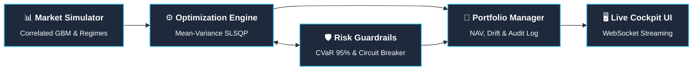

# FortressFi // Adaptive Risk-Guardrail Portfolio Engine

> **Automated capital management with real-time risk guardrails, Mean-Variance optimization, and tiered circuit-breaker controls.**

[](https://www.python.org/)
[](https://fastapi.tiangolo.com/)
[](https://numpy.org/)
[](https://scipy.org/)
[](https://developer.mozilla.org/en-US/docs/Web/API/WebSockets_API)
[](https://www.chartjs.org/)
[](https://fortressfi.onrender.com)
[](https://docs.pytest.org/)

🌐 **Live Interactive Cockpit**: [https://fortressfi.onrender.com](https://fortressfi.onrender.com)

An institutional-grade portfolio optimization and risk control system that dynamically rebalances capital allocation across 6 asset classes, enforces multi-layered risk guardrails (Monitor → Warn → Act → Circuit Break), and explains every automated decision in plain language through a real-time interactive dashboard.

Built for the **Init26 FinTech Hackathon** at MPSTME (Asset & Capital Management / Optimization Controls track).

---

## 🎯 Problem Statement Alignment

This system directly addresses all three required areas from the hackathon brief:

| Brief Requirement | Our Solution | Key Files |
|---|---|---|
| **Optimization Strategy**: Maximize risk-adjusted returns, handle constraints, dynamic rebalancing | Mean-Variance optimization (SLSQP) with regime-adaptive risk aversion, drift-based rebalancing triggers, turnover constraints | `engine/optimization_engine.py` |
| **Control & Safeguard System**: Detect, prevent, respond to risk breaches in real time | CVaR monitoring via historical simulation, 4-tier guardrail system with automatic de-risking, circuit breaker with recovery conditions | `engine/risk_engine.py` |
| **Decision Dashboard**: Visualize exposure, understand decisions, scenario testing | Real-time WebSocket dashboard with allocation charts, risk gauges, decision audit log, what-if scenario simulator | `static/index.html`, `static/app.js` |

---

## 🏗️ System Architecture



**Execution Flow per Tick:**
1. **Market Simulator** generates correlated asset returns across market regimes.
2. **Portfolio State** updates asset holdings and NAV from natural price movement.
3. **Risk Guardrails** evaluate 95% CVaR, drawdown, and concentration against dynamic thresholds.
4. **Autonomous Control**: If thresholds are breached, system triggers automated de-risking or circuit break.
5. **Drift-Gated Optimization**: If safe and drift exceeds threshold, SLSQP solves optimal allocation.
6. **Real-Time Telemetry**: Engine state and plain-English audit records push to cockpit via WebSocket.

---

## 💰 Financial Logic

### Optimization (Mean-Variance)

The optimizer maximizes a standard risk-adjusted return objective:

```
maximize:  μᵀw - (λ/2) × wᵀΣw - γ × turnover
```

Where:
- **μ** = Expected returns (exponentially-weighted rolling estimate, annualized)
- **Σ** = Covariance matrix (exponentially-weighted, annualized)
- **λ** = Risk aversion parameter (**regime-adaptive**: 2.0 in low-vol, 12.0 in crisis)
- **γ** = Turnover penalty coefficient
- **w** = Portfolio weights

**Constraints:**
- Weights sum to 1 (fully invested)
- Per-asset min/max bounds (e.g., Cash ≥ 5%, any asset ≤ 45%)
- Total turnover ≤ 40% per rebalance

The objective is smooth and quadratic; **SLSQP is the correct solver**. CVaR is intentionally NOT in the optimization objective (see Risk Engine below).

**Why drift-based rebalancing?** The optimizer only runs when the maximum single-asset drift from target exceeds a regime-adjusted threshold (5% normally, 2% in crisis). This prevents unnecessary trading and directly addresses the brief's requirement for handling rebalancing "without incurring transaction penalties."

### Risk Engine (CVaR as Guardrail Gate)

CVaR is computed via **historical simulation**: sort the rolling 60-day portfolio returns, take the mean of the worst 5%. This is exact for discrete samples with no smoothness issues because CVaR is not in any optimization objective.

**Why this architecture?** The optimizer finds the best risk-return allocation. The risk engine independently monitors tail risk and can **veto or override** the optimizer when conditions deteriorate. This separation is how many real institutional systems work.

**Monitored metrics:**

| Metric | Method | Purpose |
|---|---|---|
| VaR (95%) | 5th percentile of rolling returns | Standard risk threshold |
| CVaR (95%) | Mean of returns below VaR | Tail risk severity (primary gating metric) |
| Max Drawdown | Peak-to-trough NAV decline | Capital preservation |
| Concentration (HHI) | Σ(wᵢ²) | Diversification quality |

**Tiered guardrail response:**

| Level | Trigger | Action |
|---|---|---|
| 🟢 MONITOR | All metrics within bounds | Normal operation |
| 🟡 WARN | Any metric > 80% of limit | Alert + tighten rebalancing sensitivity |
| 🔴 ACT | Any metric breaches limit | Auto de-risk: reduce equity, increase bonds/cash |
| ⚫ CIRCUIT BREAK | Drawdown > 15% or CVaR > 2× limit | Override to defensive allocation, suspend optimization |

Thresholds are **regime-adjusted**: in crisis regime, limits tighten by 40%, making the system more defensive before conditions worsen.

Circuit breaker includes a **recovery condition**: won't release until drawdown recovers below 10% AND volatility drops below crisis level.

### Market Simulator

Generates correlated multi-asset returns using Cholesky decomposition of a configurable correlation matrix. Volatility regime is classified from rolling 20-day realized equity vol. During High/Crisis regimes, the correlation matrix blends toward a stressed version (modeling correlation spike during crashes).

**6 asset classes:** US Equity, Int'l Equity, Govt Bonds, Corp Bonds, Commodities, Cash

**4 pre-built scenarios:** Normal Markets, Gradual Crash, Sudden Shock, Recovery Rally

---

## 🖥️ Dashboard

**Real-time panels:**
- **Alert Banner**: Current guardrail level with pulsing animation for WARN/ACT/CIRCUIT BREAK
- **NAV Performance**: Line chart with dynamic coloring based on performance
- **Portfolio Allocation**: Donut chart + horizontal bar breakdown
- **Risk Metrics**: VaR, CVaR, Drawdown, HHI gauges with threshold coloring
- **Decision Audit Log**: Scrolling feed with plain-language explanations and severity badges
- **Scenario Simulator**: Input market shocks per asset, see projected impact and guardrail response

---

## 🚀 Quick Start

### Prerequisites
- Python 3.10+ (tested on 3.14)
- pip

### Installation

```bash
# Clone the repository
git clone https://github.com/tarun05-design/FortressFi.git
cd FortressFi

# Install dependencies
pip install -r requirements.txt
```

### Run

```bash
python server.py
```

Open **http://localhost:8000** in your browser.

### Usage

1. Select a scenario (Gradual Crash, Sudden Shock, etc.)
2. Click **Start** to begin the simulation
3. Watch real-time portfolio updates, risk metrics, and guardrail responses
4. Use the **Scenario Simulator** to test hypothetical market shocks
5. Review the **Decision Audit Log** for plain-language explanations of all automated actions

---

## 📁 Project Structure

```
├── .gitignore                   # Production repository exclusions
├── Procfile                     # Web process definition for cloud PaaS (Render)
├── render.yaml                  # Cloud deployment configuration
├── README.md                    # Architecture & system documentation
├── requirements.txt             # Python dependencies & test runner
├── server.py                    # FastAPI server (entry point & lifespan)
├── engine/                      # Core Financial & Quantitative Logic
│   ├── __init__.py              # Package exports & public API
│   ├── config.py                # Asset parameters, covariance matrices & guardrail limits
│   ├── models.py                # Dataclasses & Pydantic schemas (VaR, CVaR, decisions)
│   ├── market_simulator.py      # Correlated returns & regime classification
│   ├── optimization_engine.py   # SLSQP Mean-Variance optimization with smooth turnover
│   ├── risk_engine.py           # Historical CVaR, drawdown & 4-tier guardrail evaluation
│   └── portfolio.py             # Portfolio state tracking & chronological decision audit
├── services/                    # Application Service Layer
│   ├── __init__.py              # Service package init
│   └── simulation_service.py    # Async simulation orchestration & WebSocket streaming
├── static/                      # Zero-Build Institutional Cockpit UI
│   ├── index.html               # Semantic HTML5 dashboard layout
│   ├── styles.css               # Vanilla CSS design system (glassmorphism & tokens)
│   └── app.js                   # Telemetry charts, event bus & WebSocket client
├── tests/                       # Automated Verification Suite (40/40 Passing)
│   ├── conftest.py              # Test fixtures & mock portfolio factories
│   ├── test_api.py              # REST & WebSocket endpoint integration tests
│   ├── test_market_simulator.py # Regime & correlation verification
│   ├── test_optimization_engine.py # SLSQP convergence & turnover constraints
│   ├── test_portfolio.py        # NAV tracking, drift & audit trail tests
│   └── test_risk_engine.py      # VaR, CVaR & guardrail boundary tests
└── template/                    # Hackathon deliverables & presentation assets
    ├── FortressFi_Presentation.pptx # hackathon presentation (8 slides)
    ├── INIT_26_PPT_FORMAT.pptx  # Original competition template
    ├── readme_fintech.md        # FinTech track problem brief & evaluation criteria
    └── images/                  # High-resolution dashboard telemetry screenshots
```

---

## 🔌 API Reference

| Endpoint | Method | Description |
|---|---|---|
| `/` | GET | Dashboard UI |
| `/api/portfolio` | GET | Current portfolio state + metrics |
| `/api/history` | GET | Full history (NAV, weights, returns) |
| `/api/decisions` | GET | Decision audit log |
| `/api/config` | GET | Simulation configuration |
| `/api/scenario` | POST | What-if scenario analysis |
| `/api/simulation/start` | POST | Start simulation |
| `/api/simulation/stop` | POST | Stop simulation |
| `/api/simulation/reset` | POST | Reset to initial state |
| `/api/simulation/speed` | POST | Change tick speed |
| `/ws/live` | WS | Real-time state stream |

---

## 🛠️ Tech Stack

| Layer | Technology | Rationale |
|---|---|---|
| Backend | Python + FastAPI | Financial math ecosystem, async + WebSocket native |
| Optimization | SciPy SLSQP | Correct solver for smooth quadratic objective |
| Risk Computation | NumPy | Sort/percentile for CVaR: exact, fast, no smoothness issues |
| Market Simulation | NumPy + Cholesky | Realistic correlated returns with regime dynamics |
| Frontend | HTML/CSS/JS + Chart.js | Zero build step, instant deploy, premium dark-mode UI |
| Real-time | WebSocket | Sub-second portfolio state streaming |

---

## 📊 Design Decisions & Trade-offs

1. **Mean-Variance + CVaR-as-guardrail vs. Mean-CVaR LP**: We chose to optimize on variance (smooth, quadratic, SLSQP handles cleanly) and use CVaR as a monitoring/gating metric. This avoids the complexity of Rockafellar-Uryasev LP formulation while maintaining genuine tail risk control through the guardrail system.

2. **Self-contained simulation vs. live market data**: Using a configurable market simulator ensures the demo always works reliably and lets us showcase the system's behavior under controlled stress scenarios, which is impossible with live data.

3. **Drift-based rebalancing vs. periodic**: Only rebalancing when drift exceeds a threshold (regime-adjusted) prevents unnecessary trading, directly addressing the brief's transaction cost concern.

4. **Tiered guardrails vs. binary alerts**: The 4-level escalation (Monitor → Warn → Act → Circuit Break) with graduated responses is more realistic and demonstrates deeper risk management thinking than simple threshold alerts.

---

*Built for Init26 FinTech Hackathon at MPSTME*
